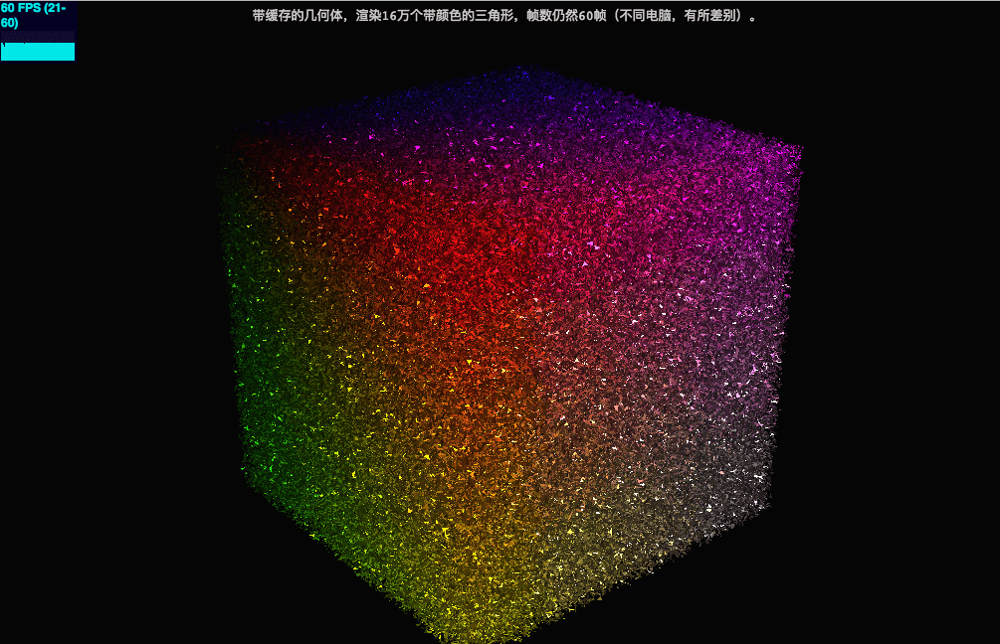

#### 3D世界的高性能渲染技术

> 摘要：本文以一个实例为主线为您介绍3D世界的高性能渲染原理，通过这样的实践，我们可以在浏览器渲染几十万个三角形仍然保持30帧以上的帧数。全文主要基于Three.js框架，会为您介绍ArrayBuffer类型化数组、BufferGeometry、三角形绘制等方面知识。不得不说Three.js是一款非常优秀的javascript 3D库。

***效果示例：***



***抛砖引玉：***

------

- 在3D的世界里，3D模型由顶点`vertex`组成，顶点之间连成三角形和四边形，并最终由无数个多边形构成复杂的立体模型。
- 基于对上条内容的认知，使用`Three.js`来绘制几十万个三角形的步骤可以简化为：

    开始 —> 定义一个`Geometry`几何体 —> 添加几十万个顶点`Vector3`到`Geometry` —> 设置每个顶点的颜色、法向量 —> 渲染三角形 —> 结束。
    ```js
      var geometry = new THREE.Geometry();
      for (var i = 0; i < 300000; i++) {
          geometry.vertices.push(new THREE.Vector3(-10 * Math.random() + 10, -20 * Math.random() + 10, -20 * Math.random() + 10));
          geometry.vertices.push(new THREE.Vector3(-10 * Math.random() + 10, -20 * Math.random() + 10, -20 * Math.random() + 10));
          geometry.vertices.push(new THREE.Vector3(-10 * Math.random() + 10, -20 * Math.random() + 10, -20 * Math.random() + 10));
          geometry.vertices.push(new THREE.Vector3(-10 * Math.random() + 10, -20 * Math.random() + 10, -20 * Math.random() + 10));
      }
    ```

- 上述的绘制原理：每一个new都代表开辟新的内存空间。这些内存空间都不是连续的，读取的时候需要不断的重新寻址，效率十分低下。
- 需要分配连续的内存，来存放这些`Vector3`，`CPU`和`GPU`才能够一气呵成，将所有的`Vector3`一次送入帧缓存中绘制出来。

***庖丁解牛：***

------


- **`FrameBuffer`帧缓存**：缓冲区是一块内存或在相应硬件中开辟的空间，目的是为了保存像素数据中的相关信息。帧缓冲存储器`FrameBuffer`：简称帧缓存或显存，它是屏幕所显示画面的一个直接映象，又称为位映射图`BitMap`或光栅。帧缓存的每一存储单元对应屏幕上的一个像素，整个帧缓存对应一帧图像。

- **类型化数组**：
  1. 所谓WebGL，就是指浏览器与显卡之间的通信接口，为了满足JavaScript与显卡之间大量的、实时的数据交换，它们之间的数据通信必须是二进制的，而不能是传统的文本格式。
  2. 以文本格式传递一个32位整数，两端的JavaScript脚本与显卡都要进行格式转化，将非常耗时。这时要是存在一种机制，可以像[C语言](http://lib.csdn.net/base/c)那样，直接操作字节，然后将4个字节的32位整数，以二进制形式原封不动地送入显卡，脚本的性能就会大幅提升。
  3. ***`Typed Array`类型化数组*** 就是在这种背景下诞生的。它很像C语言的数组，允许开发者以数组下标的形式，直接操作内存。有了类型化数组以后，`JavaScript`的二进制数据处理功能增强了很多，接口之间完全可以用二进制数据通信。

    ```js
    //生成了一段32字节的连续内存区域。
    var buf = new ArrayBuffer(32);
    //ArrayBuffer作为内存区域，可以存放多种类型的数据。不同数据有不同的存储方式，这就叫做“视图”。目前，JavaScript提供以下类型的视图：
    Int8Array：    8位有符号整数，长度1个字节。
    Uint8Array：   8位无符号整数，长度1个字节。
    Int16Array：   16位有符号整数，长度2个字节。
    Uint16Array：  16位无符号整数，长度2个字节。
    Int32Array：   32位有符号整数，长度4个字节。
    Uint32Array：  32位无符号整数，长度4个字节。
    Float32Array： 32位浮点数，长度4个字节。
    Float64Array： 64位浮点数，长度8个字节。
    ```

- **BufferGeometry**：通常情况下：物体的形状可以用`Geometry`类来表示，物体的顶点内容如果要放在缓冲区中，也可以用new分配一块连续的内存。而在`Three.js`中，开发者将两者统一起来, 形成了一个新的类，这个类是`THREE.BufferGeometry`，它是缓存和形状的组合。


***春种秋收：***

------

- ​构造BufferGeometry

    ```js
    var geometry = new THREE.BufferGeometry();
    geometry.attributes = {
        //索引
        index: {
            itemSize: 1,
            array: new Uint16Array(triangles * 3),
            numItems: triangles * 3
        },
        //顶点位置
        position: {
            itemSize: 3,
            array: new Float32Array(triangles * 3 * 3),
            numItems: triangles * 3 * 3
        },
        //顶点法线
        normal: {
            itemSize: 3,
            array: new Float32Array(triangles * 3 * 3),
            numItems: triangles * 3 * 3
        },
        //顶点颜色
        color: {
            itemSize: 3, //一个项目有几个数值构成。
            array: new Float32Array(triangles * 3 * 3), //连续的内存内存数组
            numItems: triangles * 3 * 3 //一共有几个项目。
        }
    };
    ```

- 绘制三角形

    ```js
    var positions = geometry.attributes.position.array;
    var normals = geometry.attributes.normal.array;
    var colors = geometry.attributes.color.array;
    var color = new THREE.Color();

    var n = 800, n2 = n / 2; //把三角形顶点限制在边长为800的立方体中
    var d = 12, d2 = d / 2;  //每个三角形的编程时

    var pA = new THREE.Vector3();
    var pB = new THREE.Vector3();
    var pC = new THREE.Vector3();

    var cb = new THREE.Vector3();
    var ab = new THREE.Vector3();

    for (var i = 0; i < positions.length; i += 9) {
        // 让X,Y,Z可能的值是-400到400之间
        var x = Math.random() * n - n2;
        var y = Math.random() * n - n2;
        var z = Math.random() * n - n2;

        //-6到6之间，小三角形
        var ax = x + Math.random() * d - d2;
        var ay = y + Math.random() * d - d2;
        var az = z + Math.random() * d - d2;

        var bx = x + Math.random() * d - d2;
        var by = y + Math.random() * d - d2;
        var bz = z + Math.random() * d - d2;

        var cx = x + Math.random() * d - d2;
        var cy = y + Math.random() * d - d2;
        var cz = z + Math.random() * d - d2;

        positions[i] = ax;
        positions[i + 1] = ay;
        positions[i + 2] = az;

        positions[i + 3] = bx;
        positions[i + 4] = by;
        positions[i + 5] = bz;

        positions[i + 6] = cx;
        positions[i + 7] = cy;
        positions[i + 8] = cz;

        //计算每个点的法向量
        pA.set(ax, ay, az);
        pB.set(bx, by, bz);
        pC.set(cx, cy, cz);

        //BC向量 pC-pB
        cb.subVectors(pC, pB);
        //BA向量 pA-pB
        ab.subVectors(pA, pB);
        //叉积：垂直于ab，cb 垂直于这个三角形
        cb.cross(ab);
        //规范化
        cb.normalize();

        var nx = cb.x;
        var ny = cb.y;
        var nz = cb.z;

        normals[i] = nx;
        normals[i + 1] = ny;
        normals[i + 2] = nz;

        normals[i + 3] = nx;
        normals[i + 4] = ny;
        normals[i + 5] = nz;

        normals[i + 6] = nx;
        normals[i + 7] = ny;
        normals[i + 8] = nz;

        // 设置颜色
        var vx = ( x / n ) + 0.5;
        var vy = ( y / n ) + 0.5;
        var vz = ( z / n ) + 0.5;
        color.setRGB(vx, vy, vz);
        colors[i] = color.r;
        colors[i + 1] = color.g;
        colors[i + 2] = color.b;

        colors[i + 3] = color.r;
        colors[i + 4] = color.g;
        colors[i + 5] = color.b;

        colors[i + 6] = color.r;
        colors[i + 7] = color.g;
        colors[i + 8] = color.b;

    }
    ```

- 给geometry设置索引和偏移量：本文使用Unit16Array函数分配了48万个无符号整形给array数组。其中每一个元素都表示顶点的一个索引。然而无符号整数最大只能是65535这个数，Geometry提供offsets来设置偏移​。

    ```js
    var chunkSize = 65535;
    var indices = geometry.attributes.index.array;
    for (var i = 0; i < indices.length; i++) {
        indices[i] = i % chunkSize;
    }
    geometry.offsets = [];
    var offsets = triangles * 3 / chunkSize;
    for (var i = 0; i < offsets; i++) {
        var offset = {
            start: i * chunkSize,
            index: i * chunkSize,
            count: Math.min(triangles * 3 - ( i * chunkSize ), chunkSize)
        };
        geometry.offsets.push(offset);
    }
    ```

***举一反三：***

- 当内存空间不足以支撑开辟连续内存空间的时候，如何解决？
- 时间发现，当渲染的三角形个数足够大的时候，FPS会下降到30帧，到达硬件的瓶颈，如何解决？


***参考文档：***

1. [OpenGL ES入门12-帧缓存与叠加滤镜](http://www.jianshu.com/p/8794d437e3ab)
2. ​[ArrayBuffer：类型化数组](http://blog.csdn.net/lichwei1983/article/details/43893025)
3. ​[Three.js源码注释](http://blog.csdn.net/column/details/omni360threejs.html)
4. ​[OpenGL绘图学习总结](http://cuiqingcai.com/2467.html)
5. ​[[译]THREE.JS入门教程-1.开始使用THREE.JS](http://www.cnblogs.com/yiyezhai/archive/2013/01/21/2863552.html)


