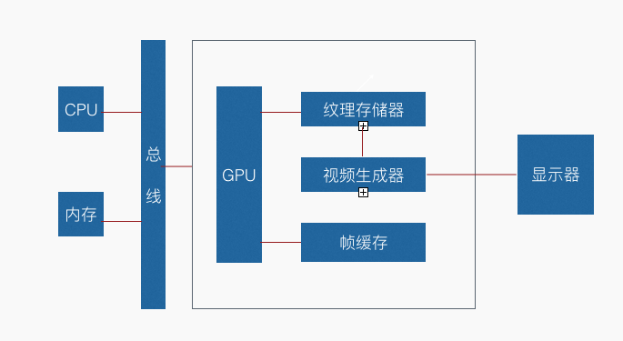
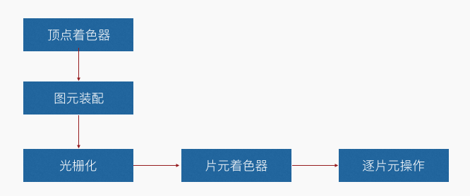

#### 第一个WebGL小程序

**WebGL是什么：**

- 在浏览器绘制 3D 图形
- 内嵌在浏览器中
- 多平台运行
- 基于 OpenGL ES 2.0


**图像硬件简介：**




**WebGL 程序执行原理— 图形流水线：**



**开发 WebGL 程序的基本步骤：**

1. 得到 canvas 标签
2. 得到绘制上下文对象
3. 编写着色器
4. 初始化着色器
5. 绘制

**着色器的初始化与调试— 初始化着色器步骤：**

1. 创建顶点着色器
2. 把源代码导入着色器对象
3. 对着色器对象进行编译
4. 创建 program
5. 附着顶点和片元着色器到  program
6. 链接 program
7. 使用 program


**源代码：**

```html
<!DOCTYPE html>
<html>
<head lang="en">
    <meta charset="UTF-8">
    <title>第一个WegGL小程序</title>
</head>
<body>
<canvas id="webgl" width="500" height="500"></canvas>
<script>
    // 初始化着色器
    function initShader(gl, vertexShaderSource, fragmentShaderSource) {
        //创建顶点着色器对象
        var vertexShader = gl.createShader(gl.VERTEX_SHADER);
        //创建片元着色器对象
        var fragmentShader = gl.createShader(gl.FRAGMENT_SHADER);

        //加入源代码
        gl.shaderSource(vertexShader, vertexShaderSource);
        gl.shaderSource(fragmentShader, fragmentShaderSource);

        //编译源代码
        gl.compileShader(vertexShader);
        gl.compileShader(fragmentShader);

        //创建program
        var program = gl.createProgram();

        //附着顶点和片元着色器到program
        gl.attachShader(program, vertexShader);
        gl.attachShader(program, fragmentShader);

        //链接program
        gl.linkProgram(program);

        //使用program
        gl.useProgram(program);
        //调试片元着色器
        console.log(gl.getShaderInfoLog(fragmentShader));
        //返回program
        return program;
    }
</script>
<script>
    //  得到canvas标签
    var canvasElement = document.getElementById('webgl');
    //  webgl 3D上下文环境
    var context = canvasElement.getContext('webgl');

    /**
     * 顶点着色器程序
     * gl_PointSize: 点的大小（像素）
     * gl_Position： 点的位置
     */
    var vertexShaderSource = '' +
        'attribute vec4 apos;' +
        'void main(){' +
        '   gl_PointSize=20.0;' +
        '   gl_Position = apos;' +
        '}';

    /**
     * 片元着色器程序
     * gl_FragColor：颜色
     */
    var fragShaderSource = '' +
        'void main(){' +
        '   gl_FragColor = vec4(1.0,0.0,0.0,1.0);' +
        '}';

    // 把WebGL的程序进行编译
    var program = initShader(context, vertexShaderSource, fragShaderSource);
    var aposLocation = context.getAttribLocation(program, 'apos');

    context.clearColor(0.2, 0.3, 0.5, 1.0);
    context.clear(context.COLOR_BUFFER_BIT);

    var x = 0.0;
    var y = 0.0;
    for (var i = 0, j = 0.1; i < 10; i++) {
        x += j;
        y += j;
        context.vertexAttrib4f(aposLocation, x, y, 0.0, 1.0);
        context.drawArrays(context.POINTS, 0, 1);
    }
</script>
</body>
</html>
```
